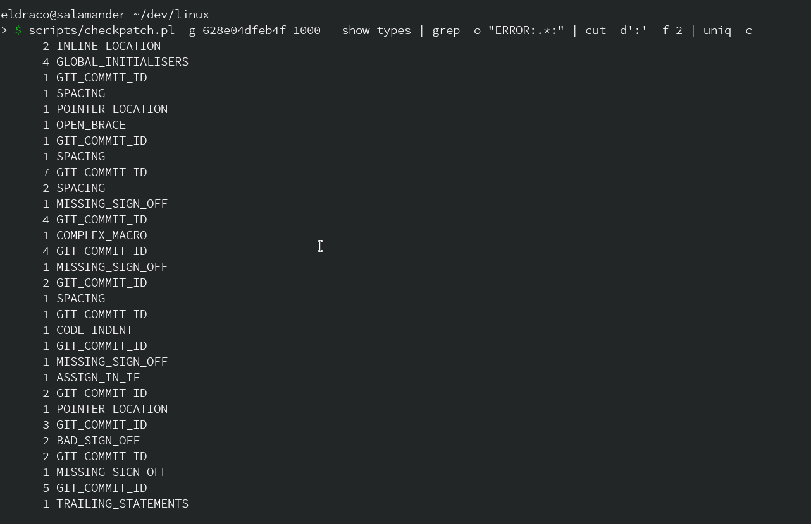
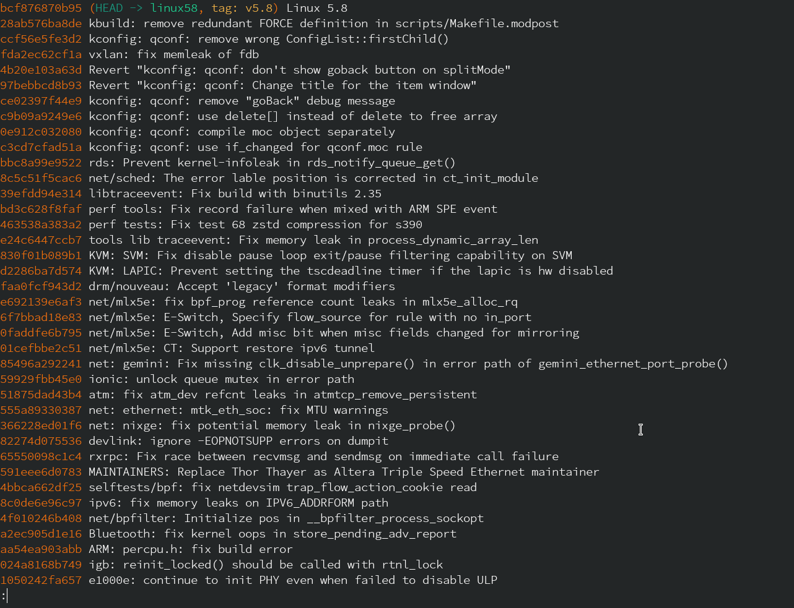
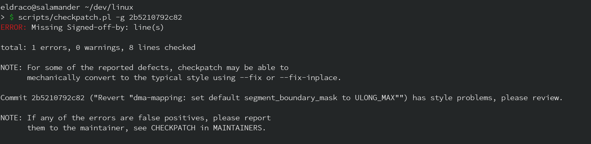
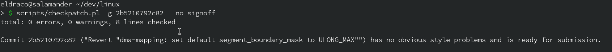

# Evaluate and Improve checkpatch.pl

### Task 1


* **sub-task 1**
> Then, the first task is to run checkpatch.pl on a few kernel patches and
collect the results.

### Result:

I used `linux-next` for analyzing commits.


I ran 

```shell
$ git log --oneline --decorate

605cbf3d5f20 (HEAD -> local, tag: next-20200820, linux-next/master) Add linux-next specific files for 20200820
2b5210792c82 Revert "dma-mapping: set default segment_boundary_mask to ULONG_MAX"
6243a08c681d Merge branch 'akpm/master' into master
cc3af00352dd (linux-next/akpm) mm/mmap: add inline munmap_vma_range() for code readability
4976ea7fcad2 mm/mmap: add inline vma_next() for readability of mmap code
17f4930d1816 mm/migrate: avoid possible unnecessary process right check in kernel_move_pages()
e5695e090000 mm/memory_hotplug: remove a wrapper for alloc_migration_target()
86e2e0cf0c30 mm/memory-failure: remove a wrapper for alloc_migration_target()
a97a53b01c09 mm/madvise: check fatal signal pending of target process
e3b6142b040e mm/madvise: Remove duplicate include
d4353d28b765 mm/madvise: introduce process_madvise() syscall: an external memory hinting API
bd60f2d54c89 pid: move pidfd_get_pid() to pid.c
.
.
.
```

```shell
$ scripts/checkpatch.pl -g 2b5210792c82

ERROR: Missing Signed-off-by: line(s)

total: 1 errors, 0 warnings, 8 lines checked

NOTE: For some of the reported defects, checkpatch may be able to
      mechanically convert to the typical style using --fix or --fix-inplace.

Commit 2b5210792c82 ("Revert "dma-mapping: set default segment_boundary_mask to ULONG_MAX"") has style problems, please review.

NOTE: If any of the errors are false positives, please report
      them to the maintainer, see CHECKPATCH in MAINTAINERS.
```

Then I ran it with a flag `--no-signoff` to avoid signoff errors 

```shell
$ scripts/checkpatch.pl --no-signoff -g 2b5210792c82

total: 0 errors, 0 warnings, 8 lines checked

Commit 2b5210792c82 ("Revert "dma-mapping: set default segment_boundary_mask to ULONG_MAX"") has no obvious style problems and is ready for submission.
```
Then I tried it on a patch too.

```shell
$ git format-patch -1 4976ea7fcad2

$ scripts/checkpatch.pl --patch 0001-mm-mmap-add-inline-vma_next-for-readability-of-mmap-.patch                                                             

total: 0 errors, 0 warnings, 50 lines checked

0001-mm-mmap-add-inline-vma_next-for-readability-of-mmap-.patch has no obvious style problems and is ready for submission.
```

* **sub-task 2**
> Can you create a list of all non-merge commits that were added in the
version v5.8 of the kernel, i.e., all non-merge commits that are in v5.8
and not already in v5.7?

```shell
$ git log --no-merges v5.7..v5.8 --oneline 

bcf876870b95 (HEAD -> linux58, tag: v5.8) Linux 5.8
28ab576ba8de kbuild: remove redundant FORCE definition in scripts/Makefile.modpost
ccf56e5fe3d2 kconfig: qconf: remove wrong ConfigList::firstChild()
fda2ec62cf1a vxlan: fix memleak of fdb
4b20e103a63d Revert "kconfig: qconf: don't show goback button on splitMode"
97bebbcd8b93 Revert "kconfig: qconf: Change title for the item window"
ce02397f44e9 kconfig: qconf: remove "goBack" debug message
c9b09a9249e6 kconfig: qconf: use delete[] instead of delete to free array
0e912c032080 kconfig: qconf: compile moc object separately
c3cd7cfad51a kconfig: qconf: use if_changed for qconf.moc rule
bbc8a99e9522 rds: Prevent kernel-infoleak in rds_notify_queue_get()
8c5c51f5cac6 net/sched: The error lable position is corrected in ct_init_module
39efdd94e314 libtraceevent: Fix build with binutils 2.35
bd3c628f8faf perf tools: Fix record failure when mixed with ARM SPE event
463538a383a2 perf tests: Fix test 68 zstd compression for s390
e24c6447ccb7 tools lib traceevent: Fix memory leak in process_dynamic_array_len
830f01b089b1 KVM: SVM: Fix disable pause loop exit/pause filtering capability on SVM
d2286ba7d574 KVM: LAPIC: Prevent setting the tscdeadline timer if the lapic is hw disabled
faa0fcf943d2 drm/nouveau: Accept 'legacy' format modifiers
e692139e6af3 net/mlx5e: fix bpf_prog reference count leaks in mlx5e_alloc_rq
6f7bbad18e83 net/mlx5e: E-Switch, Specify flow_source for rule with no in_port
0faddfe6b795 net/mlx5e: E-Switch, Add misc bit when misc fields changed for mirroring
01cefbbe2c51 net/mlx5e: CT: Support restore ipv6 tunnel
85496a292241 net: gemini: Fix missing clk_disable_unprepare() in error path of gemini_ethernet_port_probe()
59929fbb45e0 ionic: unlock queue mutex in error path
51875dad43b4 atm: fix atm_dev refcnt leaks in atmtcp_remove_persistent
555a89330387 net: ethernet: mtk_eth_soc: fix MTU warnings
366228ed01f6 net: nixge: fix potential memory leak in nixge_probe()
82274d075536 devlink: ignore -EOPNOTSUPP errors on dumpit
65550098c1c4 rxrpc: Fix race between recvmsg and sendmsg on immediate call failure
591eee6d0783 MAINTAINERS: Replace Thor Thayer as Altera Triple Speed Ethernet maintainer
4bbca662df25 selftests/bpf: fix netdevsim trap_flow_action_cookie read
8c0de6e96c97 ipv6: fix memory leaks on IPV6_ADDRFORM path
4f010246b408 net/bpfilter: Initialize pos in __bpfilter_process_sockopt
a2ec905d1e16 Bluetooth: fix kernel oops in store_pending_adv_report
aa54ea903abb ARM: percpu.h: fix build error
024a8168b749 igb: reinit_locked() should be called with rtnl_lock
1050242fa657 e1000e: continue to init PHY even when failed to disable ULP
.
.
truncated
```

```shell
$ git log --no-merges v5.7..v5.8 --oneline | wc -l

16306
```

* **sub-task 3**
> Can you suggest ideas how to aggregate the findings and create a
statistics?

For getting statistics I wrote a command like this.

```shell
$ scripts/checkpatch.pl -g 628e04dfeb4f-1000 --show-types | grep -o "ERROR:.*:" | cut -d':' -f 2 | uniq -c

      2 INLINE_LOCATION
      4 GLOBAL_INITIALISERS
      1 GIT_COMMIT_ID
      1 SPACING
      1 POINTER_LOCATION
      1 OPEN_BRACE
      1 GIT_COMMIT_ID
      1 SPACING
      7 GIT_COMMIT_ID
      2 SPACING
      1 MISSING_SIGN_OFF
      4 GIT_COMMIT_ID
      1 COMPLEX_MACRO
      4 GIT_COMMIT_ID
      1 MISSING_SIGN_OFF
      2 GIT_COMMIT_ID
      1 SPACING
      1 GIT_COMMIT_ID
      1 CODE_INDENT
      1 GIT_COMMIT_ID
      1 MISSING_SIGN_OFF
      1 ASSIGN_IN_IF
      2 GIT_COMMIT_ID
      1 POINTER_LOCATION
      3 GIT_COMMIT_ID
      2 BAD_SIGN_OFF
      2 GIT_COMMIT_ID
      1 MISSING_SIGN_OFF
      5 GIT_COMMIT_ID
      1 TRAILING_STATEMENTS

```

Let's see how command works:

* `scripts/checkpatch.pl -g 628e04dfeb4f-1000 --show-types` : this runs checkpatch.pl on 1000 commits before COMMIT 628e04dfeb4f (taken for example).

* `grep -o "ERROR:.*:" ` : this gives only lines containing errors and types. In the form of 

```
ERROR:GIT_COMMIT_ID: Please use git commit description style 'commit <12+ chars of sha1> ("<title line>")' - ie: 'commit added5fce61e ("ARM: mxs_defconfig:
```

Now I have to separate the error type and get it's count.


* `cut -d':' -f 2` : this gives me a trimmed version of output like

```
GIT_COMMIT_ID
GIT_COMMIT_ID
GIT_COMMIT_ID
GIT_COMMIT_ID
TRAILING_STATEMENTS
.
.
```

Now I have to find the count of each Error type.

* `uniq -c` : does exactly that and give me required analysis of error types.

**Other detailed statistics can be found in [STATS.md](./STATS.md) .**

### Screenshots

* for getting stats


* for `git log --no-merges v5.7..v5.8 --oneline`



* for first sub-task



