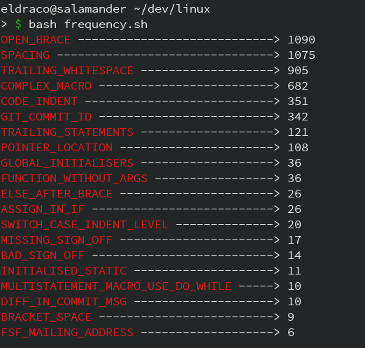
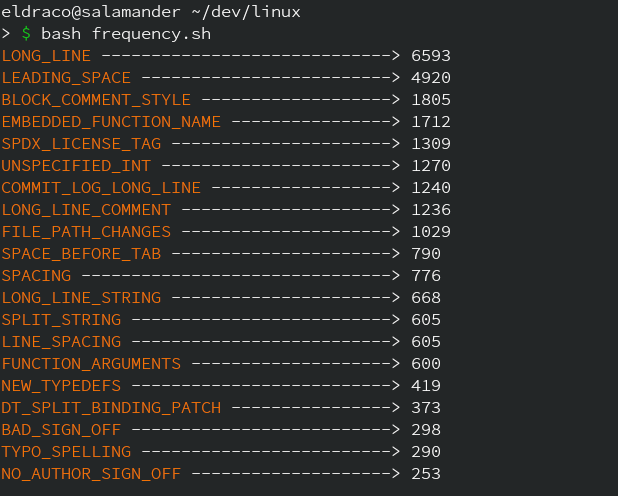
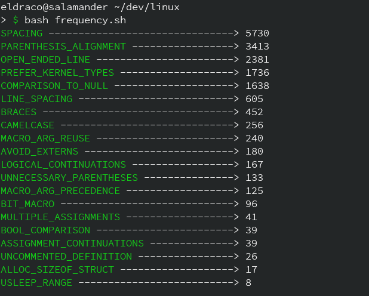

# Some stats

I wrote a [perl](./frequency.pl) and [bash](./frequency.sh) script to run checkpatch.pl on commits from v5.7 to v5.8 (Total 17595 commits) and find 20 categories that occur the most.

Script can be used to find warnings and checks after tweaking a bit.


```perl
#!/usr/bin/env perl

# Author: Ayush Karn

use strict;
use warnings;
use Term::ANSIColor qw(:constants);

# To get list of all 207 types.
my @types = `scripts/checkpatch.pl --list-types | cut -f 2 | tail -n 207`;
chomp @types;

# To get the length of longest error type
my $ll = `scripts/checkpatch.pl --list-types | cut -f 2 | tail -n 207 | wc -L`;

# Running checkpatch on commits from v5.7 to v5.8
scripts/checkpatch.pl -g bcf876870b95-17595 --show-types | grep -o "ERROR:.*:" | cut -d':' -f 2 > file.txt

my $count = 0;
my $dif = 0;
my $ctr = 1;
my $sp = "";
my $da = "";
my $d = "-";

sub space(){
		$da = "";
		$dif = $_[0]; 
		$ctr = 1;
		
		while($ctr < $dif){
			$da = $da.$d;
			$ctr = $ctr + 1;
		}

		return $da;
	}

foreach my $i (@types){
	$count = `grep -c "$i" file.txt`;
	if ( $count > 0 ){
		$dif = $ll - length($i);
		$sp = &space($dif);
		open (STDOUT, ">> count.txt");
		print RED, "$i", RESET, " $sp> $count";
		close (STDOUT);
	}
	$count=0;

}

```
#### Screenshot

* For errors




* For warnings



* For checks


